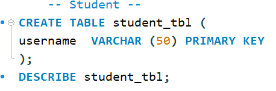
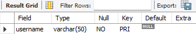
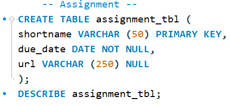
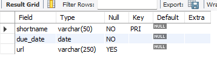
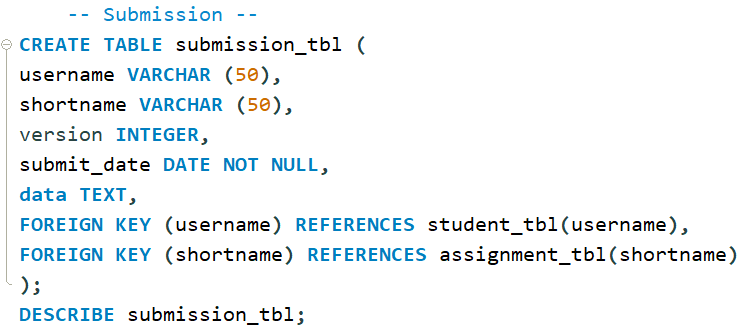
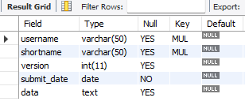
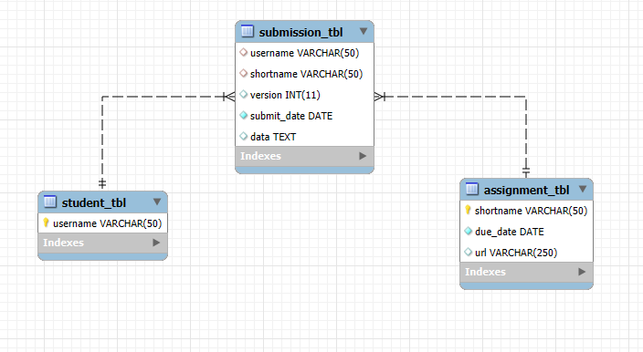

# Final Lab Task 2 - Transforming ER Model to Relational Tables

## Student Table:
- **username**: String (VARCHAR),up to 50 characters.
## Assignment Table:
- **shortname**: String (VARCHAR),up to 50 characters.
- **due_date**: Date, cannot be null.
- **url**: String (VARCHAR),up to 255 characters, can be null.
## Submission Table:
- **username**: String (VARCHAR),up to 50 characters.
- **shortname**: String (VARCHAR),up to 50 characters.
- **version**: Integer, represents the version of the submission.
- **submit_date**: Date, cannot be null.
- **data**: Text.
## Query Statements & Table Structure:
### Student:
#### Query:

#### Table:

### Assignment:
#### Query:

#### Table:

### Submission:
#### Query:

#### Table:

## ER Diagram:

